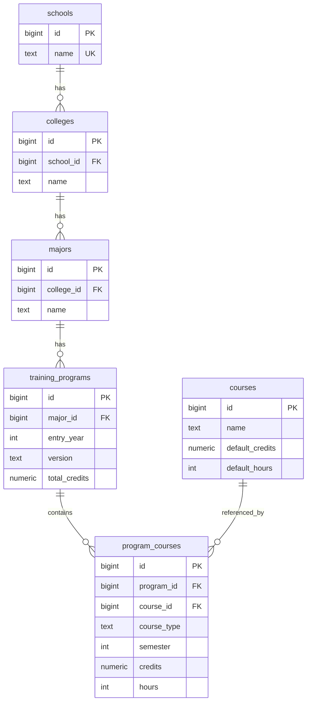

# 培养方案数据库 Schema 设计说明

## 1. 设计目标

本项目面向西南财经大学本科培养方案数据，建立关系型数据库，用于存储学校、学院、专业、培养方案、课程及培养方案中的课程安排信息。

当前任务 A 的数据范围为西南财经大学计算机与人工智能学院下的部分专业培养方案数据，重点支持显式课程信息的结构化存储与查询。

## 2. ER 图

## 3. 表结构说明

### 3.1 schools

存储学校信息。

| 字段 | 类型 | 说明 |
|---|---|---|
| id | BIGSERIAL | 学校主键 |
| name | TEXT | 学校名称 |

约束：

- `id` 为主键。
- `name` 非空且唯一，避免同一学校重复入库。

### 3.2 colleges

存储学院信息。

| 字段 | 类型 | 说明 |
|---|---|---|
| id | BIGSERIAL | 学院主键 |
| school_id | BIGINT | 所属学校 ID |
| name | TEXT | 学院名称 |

约束：

- `id` 为主键。
- `school_id` 外键引用 `schools(id)`。
- `(school_id, name)` 唯一，保证同一学校下学院名称不重复。
- 删除学校时级联删除其学院数据。

### 3.3 majors

存储专业信息。

| 字段 | 类型 | 说明 |
|---|---|---|
| id | BIGSERIAL | 专业主键 |
| college_id | BIGINT | 所属学院 ID |
| name | TEXT | 专业名称 |

约束：

- `id` 为主键。
- `college_id` 外键引用 `colleges(id)`。
- `(college_id, name)` 唯一，保证同一学院下专业名称不重复。
- 删除学院时级联删除其专业数据。

### 3.4 training_programs

存储专业培养方案的基本信息。

| 字段 | 类型 | 说明 |
|---|---|---|
| id | BIGSERIAL | 培养方案主键 |
| major_id | BIGINT | 所属专业 ID |
| entry_year | INT | 入学年级 |
| version | TEXT | 培养方案版本 |
| total_credits | NUMERIC(5,1) | 培养方案总学分要求 |

约束：

- `id` 为主键。
- `major_id` 外键引用 `majors(id)`。
- `(major_id, entry_year, version)` 唯一，避免同一专业、同一年级、同一版本的培养方案重复。
- 删除专业时级联删除其培养方案数据。

### 3.5 courses

存储课程基础信息。

| 字段 | 类型 | 说明 |
|---|---|---|
| id | BIGSERIAL | 课程主键 |
| name | TEXT | 课程名称 |
| default_credits | NUMERIC(4,1) | 默认学分 |
| default_hours | INT | 默认学时 |

约束：

- `id` 为主键。
- `(name, default_credits, default_hours)` 唯一，减少重复课程记录。

### 3.6 program_courses

存储某个培养方案中的课程安排，是培养方案与课程之间的关联表。

| 字段 | 类型 | 说明 |
|---|---|---|
| id | BIGSERIAL | 关联记录主键 |
| program_id | BIGINT | 培养方案 ID |
| course_id | BIGINT | 课程 ID |
| course_type | TEXT | 课程类别，如必修、选修等 |
| semester | INT | 建议修读学期 |
| credits | NUMERIC(4,1) | 该培养方案中的课程学分 |
| hours | INT | 该培养方案中的课程学时 |

约束：

- `id` 为主键。
- `program_id` 外键引用 `training_programs(id)`。
- `course_id` 外键引用 `courses(id)`。
- `(program_id, course_id, course_type, semester)` 唯一，避免同一培养方案中同一课程安排重复导入。
- 删除培养方案或课程时级联删除对应关联记录。

## 4. 索引设计

为提高常用查询效率，系统建立了以下索引：

- `idx_colleges_school_id`：加速按学校查询学院。
- `idx_majors_college_id`：加速按学院查询专业。
- `idx_training_programs_major_id`：加速按专业查询培养方案。
- `idx_courses_name`：加速按课程名称查询。
- `idx_program_courses_program_id`：加速按培养方案查询课程。
- `idx_program_courses_course_id`：加速按课程查询开设专业。
- `idx_program_courses_semester`：加速按学期排序或筛选。
- `idx_program_courses_course_type`：加速按课程类型查询。
- `idx_courses_name_trgm`：基于 `pg_trgm`，支持课程名称模糊搜索。

## 5. 规范化设计说明

数据库将培养方案数据拆分为学校、学院、专业、培养方案、课程和培养方案课程关联表，避免将学院、专业、课程等重复文本全部堆在一张大表中。

这种设计具有以下优点：

1. 降低数据冗余。
2. 通过主键和外键保证数据关联一致性。
3. 支持从不同维度查询，例如按专业查课程、按课程查专业、按学院汇总培养方案。
4. 为后续扩展跨学校数据或培养方案版本管理保留空间。

## 6. 当前设计边界

当前任务 A 版本主要支持显式列出的课程查询，暂未完整结构化以下复杂规则：

1. 外语类、通识核心课、通识选修课中的模块任选逻辑。
2. `1-2` 这类跨学期课程表达。
3. “至少选修其中一门”等组合约束。
4. 毕业实习、毕业论文等课程名称的进一步标准化。

因此，当前系统适合用于完成题目 A 的基础数据查询和演示，但不保证所有培养方案总学分都严格等于已显式列出的课程学分求和。
